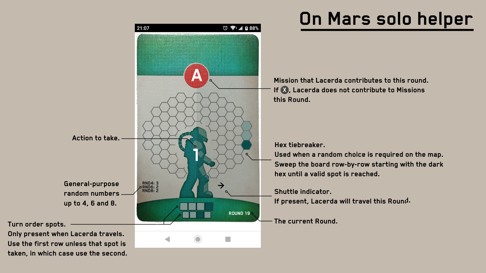

# On Mars solo helper app

## Intro

The solo variant of the boardgame On Mars (designed by Vital Lacerda, published
by Eagle-Gryphon Games) requires the human player to make certain decisions on
behalf the bot randomly. This minimalistic application aims to streamline those
decisions, and provide randomly generated choices along the "card draw".

The solo deck contains the following twelve cards:

 - action 1, mission A, travel
 - action 1, mission B, travel
 - action 1, mission B, travel
 - action 1, mission C, travel
 - action 1, mission C, don't travel
 - action 2, mission A, travel
 - action 2, mission A, don't travel
 - action 2, mission B, travel
 - action 2, mission C, travel
 - action 3, mission A, travel
 - action 3, mission B, don't travel
 - action 3, mission C, travel

The application uses the same cards, but presents the information a bit
differently, and also helps choosing random actions.

## Random actions

### Hex tiebreaker

This one is to be used during Constructions, Building
Upgrades and Rover movement, when a random choice is necessary. The method is
"stolen" from Tapestry's Automaa, i.e. the application gives a starting row and
a starting tile, and the player have to sweep the board row by row until a valid
hex for the specific action is reached. 

### Turn order place

This one gives the player a primary and a secondary turn
order place. Only available if Lacerda travels this Round (the Shuttle indicator
is present on the card), and the user clicked the card (in order to hide
Lacerda's choice at the beginning of the Round). 

### General purpose random numbers

There are other situations in the game when
a random choice is required (e.g. Lacerda takes a scientist, but neither of you
have any Advanced Buildings). The application provides three random numbers per
turn in three different ranges: 1-4, 1-6 and 1-8. This feature might change in
the future depending on how useful it is (e.g. it might be possible in the
future to generate new ones within a Round).

The following image explains how these information are presented:

## Usage

Load the [application](https://sghctoma.github.io/wwwacerda) in a web browser,
and start clicking :) The application only "replaces" the solo cards, i.e. it
won't give you an initial Turn Order spot for Lacerda - you still have to do it
as written in the rulebook. Your first click reveals Lacerda's first action. If
Lacerda uses the Shuttle this Round, the next click reveals the Turn Order spot
he chooses, and the next action is revealed only after another click. If he
does not use the Shuttle in a Round, the click immediately reveals the next
action.

**DISCLAIMER**: I've put together this project to streamline my solo games a
bit, and a web application seemed the most reasonable choice. That said, I'm not
a web developer, so the code might not be as pretty as it should be. Neither is
the application itself: the card images are made from a photo taken with my
cellphone... I also didn't want to torture myself with measuring pixels and
calculating positions, so every layer is a full-sized image. Interactions with
the app are not that frequent (once in a round), so this should not be a real
problem though. To summarize: it's a working, but quick&dirty solution.

